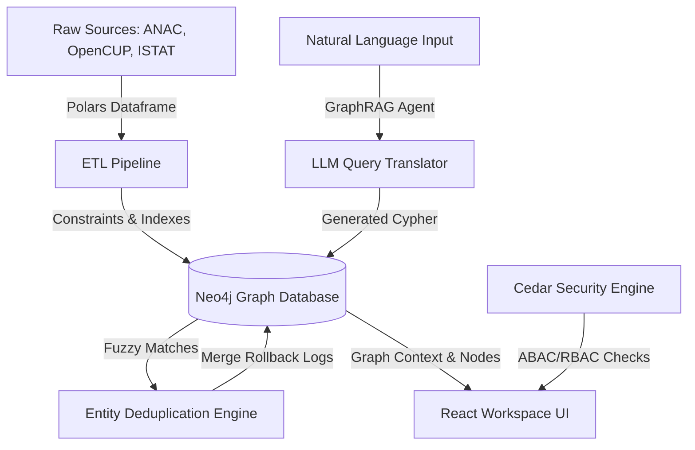

# 🛡️ Paladino — Sovereign Public Funds Intelligence Workspace

[🇬🇧 English](README.md) • [🇮🇹 Italiano](README_IT.md)

[](LICENSE)
[](https://www.python.org/downloads/)
[](https://github.com/psf/black)

> **"Segui i soldi."**
> Paladino is the local-first intelligence workspace designed for compliance analysts, investigative journalists, and threat researchers. It maps multi-source Italian procurement data (ANAC, OpenCUP, PNRR) into a secure, offline knowledge graph, exposing corporate anomalies and ownership loops before they surface in the public record.
> 
> **100% Workstation-Native. Zero Telemetry. Absolute Data Sovereignty.**

### 💡 Plain English Explanation (For non-technical readers)
Think of Paladino as a digital detective. When public money is spent (like building a highway or funding a school project), it’s hard to make sure those funds aren't going to shell companies or offshore accounts. 
Usually, finding these red flags requires analysts to dig through thousands of separate, messy spreadsheets. 
**Paladino** automates this: it takes all those files, connects them like a social network (a graph), and lets you ask plain questions in a local AI chat (like: *"Are there any hidden links between the winning bidder and offshore companies?"*) to find anomalies in seconds.

---

## 👁️ Context & Value Proposition

In the compliance and threat intelligence space, data is messy, highly fragmented, and often locked behind heavy enterprise cloud barriers. Investigating public spending fraud or detecting supply chain anomalies requires cross-referencing billions of euros in tenders, corporate registries, and geographical data. 

Standard relational databases fall flat on multi-hop network inquiries, while traditional cloud solutions introduce unacceptable privacy and security risks for sensitive investigations.

**Paladino changes the paradigm.** 

By running entirely on local hardware, Paladino allows you to dump raw, unstructured local data (CSV, PDF, TXT) into a high-performance local pipeline. It cleans entity names, builds a unified Neo4j Knowledge Graph, and exposes an offline GraphRAG agent to query complex relationships using natural language. 

---

## ⚡ Core Pillars of the Workspace

### 1. Ingestion Guardrails & Client-Side Sanitization
Raw data is notoriously dirty. Paladino employs a client-side validation engine that intercepts uploads in real time:
*   **Checksum Validation:** Automatically verifies Codice Fiscale (CF) and CIG formats before executing Neo4j write transactions, highlighting errors instantly.
*   **Anti-Crash Memory Buffering:** Large datasets (multi-gigabyte files) are intercepted on the client side to block browser memory overflows, redirecting users to use optimized local stream ingestion directly to the database.
*   **Dynamic Label Mapping:** Ingest custom entities and properties on the fly. Nodes are dynamically merged using Neo4j APOC merge constraints, keeping the ontology flexible and scalable.

### 2. GraphRAG Chat & Semantic Mapping
Stop writing raw Cypher queries. Paladino integrates a local GraphRAG interface:
*   **Natural Language to Cypher:** Translates plain Italian questions into optimized Cypher graph queries.
*   **Multi-Hop Reasoning:** Uncovers hidden connections (e.g. sharing the same shareholder with an offshore company in a low-tax jurisdiction).
*   **Strict Provenance Tracking:** Every AI response lists its sources and shows the exact query executed, preventing AI hallucinations.

### 3. Fuzzy Entity Resolution & Transactional Rollbacks
Corporate registries often contain variations of the same company (e.g. `ACME SRL` vs `ACME S.R.L.`). 
*   **Fuzzy Deduplication:** Scans the database using Jaro-Winkler and Levenshtein similarity algorithms to find duplicate candidate entities.
*   **Side-by-Side Comparison:** Compares properties of duplicate nodes before executing a merge.
*   **Immutability & Rollback:** Logs transactional `:MergeRollback` states in the graph, letting you undo any entity merges instantly without database corruption.

### 4. Cedar-Powered Security & Audit Ledger
Paladino implements a zero-trust local environment using Amazon's open-source **Cedar** policy language:
*   **RBAC (Role-Based Access Control):** Restricts write/merge/rollback operations to `admin` level users while allowing `officer` users read-only graph explorations.
*   **ABAC (Attribute-Based Access Control):** Context-aware policies that lock data down based on geographic region, clearance levels, or data classification.
*   **Local Audit Trail:** Generates secure, append-only logs for every query and database modification, ensuring compliance with institutional investigative standards.

---

## 🛠️ Installation & Setup

### Quick Start (The One-Liner)

**Windows:**
```cmd
scripts\quickstart.bat
```

**Unix (Linux/macOS):**
```bash
chmod +x scripts/quickstart.sh && ./scripts/quickstart.sh
```

*This script boots the Neo4j instance in Docker, initializes constraints and indexes, runs migrations, and launches the FastAPI/React stack.*

---

### Manual Setup

1.  **Clone the workspace:**
    ```bash
    git clone https://github.com/YOUR_USERNAME/paladino.git
    cd paladino
    ```

2.  **Spin up the Database:**
    ```bash
    docker-compose up -d
    ```

3.  **Install Local Environment:**
    ```bash
    pip install -e ".[dev]"
    ```

4.  **Configure Credentials:**
    ```bash
    cp .env.example .env
    # Add your local Neo4j credentials, Cedar policy directories, and LLM API keys
    ```

5.  **Run Database Migrations:**
    ```bash
    python scripts/init_schema.py
    ```

6.  **Run the Stack:**
    *   **FastAPI Backend:** `paladino work --port 8000`
    *   **React Frontend:**
        ```bash
        cd frontend
        npm install
        npm run dev
        ```

---

## 📈 System Architecture



---

## 🧬 Inference Configurations

Configure local or remote LLM runtimes (Ollama, OpenRouter, Groq, OpenAI) using the interactive CLI:

```bash
paladino configure-llm
```

For 100% offline environments, we recommend running **Ollama** locally with the `meta-llama/llama-3.1-8b-instruct` model.

---

## 🧪 Verification

Validate the codebase by running unit, integration, and E2E suites:

```bash
pytest
```
