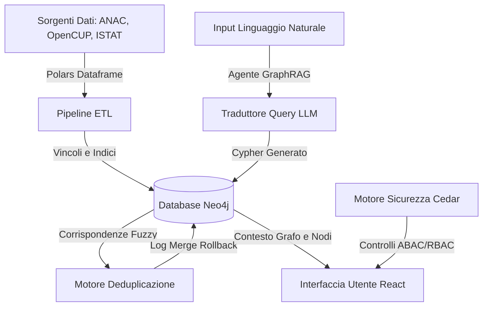

# 🛡️ Paladino — Workspace Sovrano per l'Intelligence sui Fondi Pubblici

[](LICENSE)
[](https://www.python.org/downloads/)
[](https://github.com/psf/black)

> **"Segui i soldi."**
> Paladino è un workspace di intelligence local-first progettato per analisti di conformità, giornalisti investigativi e ricercatori di minacce. Mappa i dati della spesa pubblica italiana provenienti da più fonti (ANAC, OpenCUP, PNRR) in un knowledge graph offline sicuro, esponendo anomalie societarie e relazioni nascoste prima che diventino di dominio pubblico.
> 
> **100% Nativo su Workstation. Zero Telemetria. Sovranità Assoluta dei Dati.**

### 💡 Spiegazione Semplice (Per i non addetti ai lavori)
Pensa a Paladino come a un investigatore digitale. Quando lo Stato assegna dei fondi pubblici (ad esempio per ricostruire una strada o finanziare un progetto scolastico), è difficile verificare che quel denaro non finisca ad aziende fantasma o conti offshore. 
Di solito, per scovare queste anomalie, gli analisti devono spulciare manualmente migliaia di fogli Excel complessi e disordinati. 
**Paladino** automatizza questo processo: raccoglie tutti i file, li collega tra loro come se fossero una rete sociale (un grafo) e ti permette di fare domande in italiano semplice in una chat AI locale (es. *"Ci sono collegamenti nascosti tra l'azienda vincitrice dell'appalto e società offshore?"*) per trovare riscontri in pochi secondi.

---

## 👁️ Contesto e Proposta di Valore

Nel settore della compliance e della threat intelligence, i dati sono disorganizzati, frammentati e spesso bloccati dietro pesanti barriere cloud aziendali. Indagare sulle frodi nella spesa pubblica o rilevare anomalie nella catena di fornitura richiede l'incrocio di miliardi di euro in appalti, registri societari e dati geografici.

I database relazionali tradizionali falliscono nelle query su reti di relazioni multi-hop, mentre le soluzioni cloud standard introducono rischi di privacy e sicurezza inaccettabili per le indagini sensibili.

**Paladino cambia il paradigma.**

Eseguito interamente su hardware locale, Paladino ti consente di caricare dati grezzi e non strutturati (CSV, PDF, TXT) in una pipeline locale ad alte prestazioni. Pulisce i nomi delle entità, costruisce un Knowledge Graph unificato su Neo4j ed espone un agente GraphRAG offline per interrogare relazioni complesse usando il linguaggio naturale.

---

## ⚡ I Pilastri del Workspace

### 1. Guardrail di Ingestione e Sanitizzazione Client-Side
I dati grezzi sono notoriamente sporchi. Paladino impiega un motore di convalida client-side che intercetta i caricamenti in tempo reale:
*   **Convalida dei Checksum:** Verifica automaticamente i formati di Codici Fiscali (CF) e CIG prima di eseguire le transazioni di scrittura su Neo4j, evidenziando istantaneamente gli errori.
*   **Buffer Anti-Crash della Memoria:** I dataset di grandi dimensioni (file multi-gigabyte) vengono intercettati sul client per bloccare i crash del browser, guidando l'utente verso lo streaming locale ottimizzato direttamente nel database.
*   **Mappatura Ontologica Dinamica:** Consente di importare entità ed etichette personalizzate al volo. I nodi vengono uniti dinamicamente tramite costrutti APOC merge, mantenendo l'ontologia flessibile e scalabile.

### 2. Chat GraphRAG e Mappatura Semantica
Elimina la necessità di scrivere query Cypher complesse. Paladino integra un'interfaccia GraphRAG locale:
*   **Da Linguaggio Naturale a Cypher:** Traduce domande in italiano semplice in query ottimizzate per database a grafi.
*   **Ragionamento Multi-Hop:** Rivela connessioni nascoste (es. la condivisione dello stesso azionista con una società offshore in un paradiso fiscale).
*   **Tracciamento Rigido della Provenienza:** Ogni risposta dell'AI elenca le proprie fonti e mostra l'esatta query eseguita, prevenendo le allucinazioni.

### 3. Entity Resolution Fuzzy e Rollback Transazionale
I registri aziendali spesso contengono variazioni della stessa società (es. `ACME SRL` e `ACME S.R.L.`).
*   **Deduplicazione Fuzzy:** Esegue la scansione del database utilizzando gli algoritmi di similarità Jaro-Winkler e Levenshtein per trovare entità candidate duplicate.
*   **Confronto Fianco a Fianco:** Confronta le proprietà dei nodi prima di eseguire una fusione.
*   **Immutabilità e Ripristino:** Registra gli stati transazionali `:MergeRollback` nel grafo, consentendo di annullare qualsiasi fusione all'istante senza corruzione dei dati.

### 4. Sicurezza Cedar e Registro di Audit
Paladino implementa un ambiente locale a fiducia zero (zero-trust) utilizzando il linguaggio di policy open-source **Cedar** di Amazon:
*   **RBAC (Role-Based Access Control):** Limita le operazioni di scrittura/fusione/rollback agli amministratori (`admin`), consentendo agli analisti (`officer`) l'esplorazione del grafo in sola lettura.
*   **ABAC (Attribute-Based Access Control):** Policy contestuali che bloccano l'accesso in base alla regione geografica (es. `Lombardia`) e ai livelli di clearance dei dati.
*   **Registro di Audit Locale:** Genera log protetti e immutabili per ogni query e modifica del database, garantendo la conformità agli standard investigativi istituzionali.

---

## 🛠️ Installazione e Configurazione

### Avvio Rapido (One-Liner)

**Windows:**
```cmd
scripts\quickstart.bat
```

**Unix (Linux/macOS):**
```bash
chmod +x scripts/quickstart.sh && ./scripts/quickstart.sh
```

*Questo script avvia il contenitore Neo4j in Docker, inizializza vincoli e indici, esegue le migrazioni e avvia lo stack FastAPI/React.*

---

### Configurazione Manuale

1.  **Clona il workspace:**
    ```bash
    git clone https://github.com/YOUR_USERNAME/paladino.git
    cd paladino
    ```

2.  **Avvia il Database:**
    ```bash
    docker-compose up -d
    ```

3.  **Installa l'Ambiente Locale:**
    ```bash
    pip install -e ".[dev]"
    ```

4.  **Configura le Variabili d'Ambiente:**
    ```bash
    cp .env.example .env
    # Modifica il file .env con le credenziali Neo4j e le chiavi API dei modelli LLM
    ```

5.  **Esegui le Migrazioni del Database:**
    ```bash
    python scripts/init_schema.py
    ```

6.  **Avvia lo Stack:**
    *   **Backend FastAPI:** `paladino work --port 8000`
    *   **Frontend React:**
        ```bash
        cd frontend
        npm install
        npm run dev
        ```

---

## 📈 Architettura di Sistema



---

## 🧬 Configurazione Inferenziazioni LLM

Configura i runtime LLM locali o remoti (Ollama, OpenRouter, Groq, OpenAI) tramite l'interfaccia a riga di comando:

```bash
paladino configure-llm
```

Per ambienti offline al 100%, consigliamo di eseguire **Ollama** localmente con il modello `meta-llama/llama-3.1-8b-instruct`.

---

## 🧪 Verifica e Test

Valida la base di codice eseguendo la suite completa di test unitari, di integrazione ed end-to-end:

```bash
pytest
```
